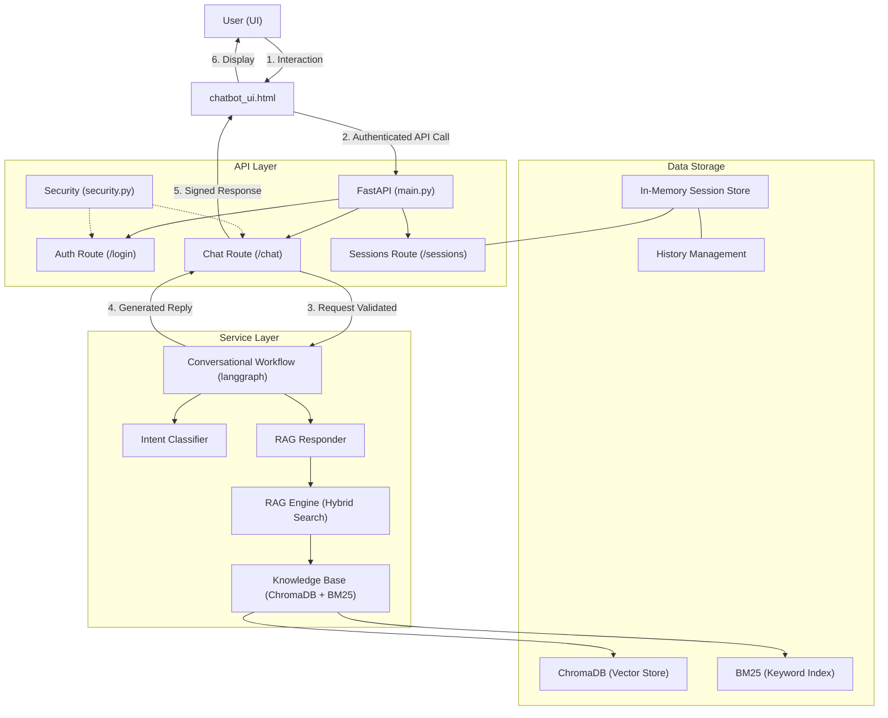

# Codebase Flow & Architecture

This document describes the end-to-end flow of the RAG Chatbot, from user interaction to retrieval and response generation.

## 1. System Architecture

## 2. Request Flow Detailed

### 1. Authentication
- User enters email in the **Settings** panel and clicks **Login**.
- Frontend calls `/auth/login`.
- Backend (`security.py`) generates a **JWT token** signed with a secret key.
- Frontend stores the token in `localStorage` and includes it in all subsequent `Authorization` headers.

### 2. Conversational Intent
- User sends a message.
- The `ConversationalWorkflow` initializes:
    - **Classifier Node**: Uses a keyword-based set + LLM fallback to categorize the intent (`products`, `warranty`, `support`, etc.).
    - **Router Node**: Directs the flow to the appropriate responder based on the category.

### 3. RAG Retrieval & Hybrid Search
- The `RAGResponder` executes the retrieval via `RAGEngine`:
    - **Semantic Search**: Queries ChromaDB for vector similarity.
    - **Keyword Search**: Queries BM25 for exact term matching.
    - **Hybrid Fusion**: Combines scores using Reciprocal Rank Fusion (RRF) or similar weighted logic.
    - **Filtering**: Applies metadata filters (e.g., `type: product`) based on the detected intent.

### 4. Selection & Generation
- Chunks above the `RELEVANCE_THRESHOLD` (0.4) are selected.
- The context-augmented prompt is sent to the LLM (Gemini 1.5/flash).
- The response is added to the **Session History** ensuring continuity.

## 3. Core Directory Structure
- `src/api`: Routes and models for FastAPI.
- `src/core`: Configuration, logging, and security.
- `src/services`: Business logic (RAG, Workflow, KB, Sessions).
- `src/utils`: Reusable prompts and helper functions.
- `data/`: ChromaDB storage and source product information.
